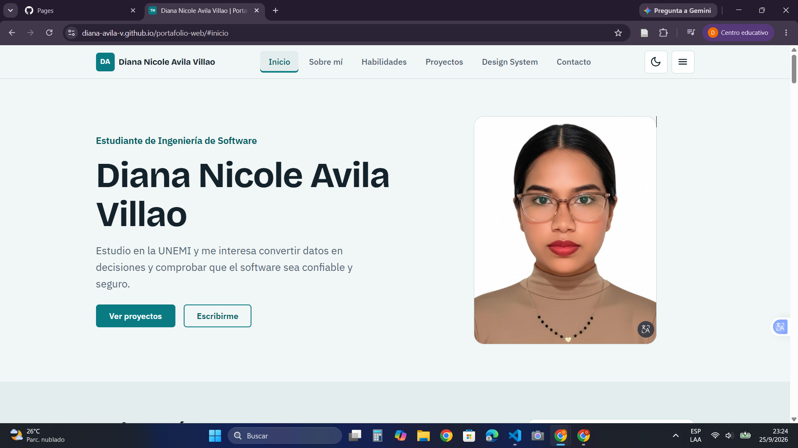
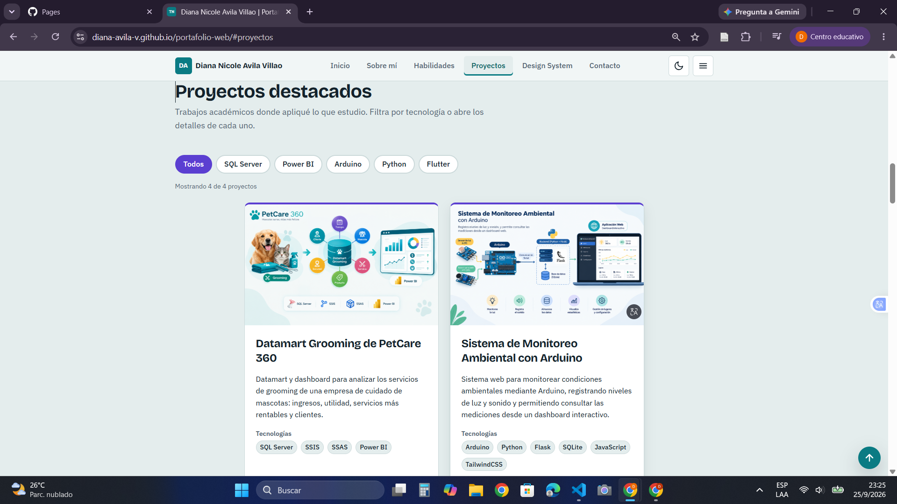
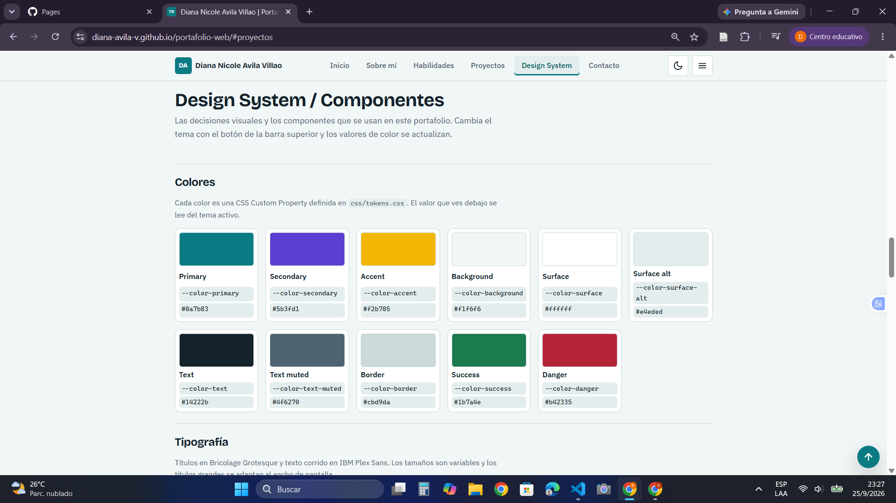

# Portafolio web profesional

Portafolio personal e interactivo de un estudiante de Ingeniería de Software de la Universidad Estatal de Milagro (UNEMI). Presenta el perfil académico, las habilidades técnicas, cuatro proyectos destacados y un Design System que documenta las decisiones visuales del propio sitio.

- Sitio publicado: https://diana-avila-v.github.io/portafolio-web/
- Repositorio: https://github.com/Diana-avila-v/portafolio-web

## Capturas

| Inicio | Proyectos | Design System |
| --- | --- | --- |
|  |  |  |

## Secciones

1. **Inicio**: presentación y esquema estrella que resume el perfil.
2. **Sobre mí**: formación, intereses y tecnologías que estoy aprendiendo.
3. **Habilidades**: agrupadas por área, con nivel de dominio explicado en una leyenda.
4. **Proyectos destacados**: cuatro tarjetas con problema, tecnologías, imagen y enlaces.
5. **Design System / Componentes**: colores, tipografía, espaciado, bordes, sombras y componentes reales del sitio.
6. **Contacto**: datos de contacto y formulario con validación.

## Tecnologías

- HTML5 semántico (`header`, `nav`, `main`, `section`, `article`, `aside`, `figure`, `figcaption`, `dialog`, `address`, `footer`).
- CSS propio, sin frameworks: CSS Custom Properties, Grid, Flexbox, media queries y unidades relativas.
- JavaScript sin librerías.
- Git y GitHub Pages para el control de versiones y la publicación.

## Interacciones con JavaScript

| Interacción | Para qué sirve |
| --- | --- |
| Tema claro y oscuro con `localStorage` | Respeta la preferencia del sistema y recuerda la elección |
| Menú responsive | Navegación con botón en teléfonos y tablets |
| Enlace activo al desplazarse | Muestra en qué sección está la persona |
| Filtro de proyectos por tecnología | Reduce la lista y anuncia el resultado con `role="status"` |
| Modal de detalles del proyecto | Usa `<dialog>` para ampliar aporte y aprendizajes |
| Validación del formulario | Mensajes de error junto a cada campo y foco en el primero inválido |
| Botón Volver al inicio | Aparece al bajar en la página |
| Valores de color en el Design System | Se leen del tema activo con `getComputedStyle` |

## Estructura de archivos

```
.
├── index.html
├── css/
│   ├── tokens.css       Custom Properties (claro y oscuro)
│   ├── base.css         Reinicio, tipografía base y utilidades
│   ├── components.css   Botón, badge, chip, card, formulario, modal, navbar
│   └── sections.css     Diseño de cada sección
├── js/
│   ├── theme-init.js    Aplica el tema antes de pintar la página
│   └── main.js          Interacciones
├── assets/img/          Imágenes y favicon
└── capturas/            Capturas para este README
```

## Decisiones de diseño

- Todas las decisiones visuales viven en `css/tokens.css`. Los demás archivos solo usan `var(--...)`, sin colores escritos a mano.
- El tema oscuro redefine los mismos tokens con `[data-theme="dark"]`, así que ningún componente necesita reglas propias para cambiar de tema.
- `theme-init.js` se carga sin `defer` para evitar el parpadeo del tema claro al abrir la página en oscuro.
- Los tamaños de título del Design System usan clases (`.h1`, `.h2`, `.h3`) para mostrar el estilo sin repetir `h1` en la página.
- Los niveles de habilidad son tres (Aprendiendo, Básico, Intermedio) y cada uno tiene una definición en la sección.
- Las animaciones (línea del esquema y apertura del modal) se desactivan con `prefers-reduced-motion`.

## Ver el sitio en tu computadora

Abre `index.html` con doble clic, o levanta un servidor local:

```bash
python -m http.server 8000
```

Luego entra a `http://localhost:8000`.


